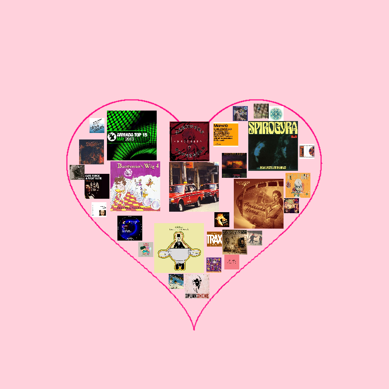

# album_cover_arrangement
## Heart-Shaped Album Cover Collage  

A Processing Java sketch that randomly arranges a set of album-cover images of varying sizes into a heart-shaped layout. 
Larger covers are placed first, then progressively smaller ones fill remaining gaps until the shape is densely packed.




---

## Features

- **Multi-size placement**: Supports any number of cover sizes (e.g. 100, 80, 50, 30 px).
- **Hierarchical filling**: Places largest covers first, then smaller covers iteratively fill residual space.
- **Strict heart mask**: Ensures every cover (including its four corners) lies within a mathematically defined heart outline.
- **Non-overlapping**: Uses axis-aligned separation checks + configurable spacing to avoid overlap.
- **Configurable**: Easily adjust cover sizes, number of placements, canvas size, and spacing.

---

## Algorithm

1. **Load Images**  
   - Scan `ALBUM_DIR` for `.jpg`/`.png` files.  
   - Load each into an `ArrayList<PImage> albums`.  

2. **Build Heart Mask**  
   - Create an off-screen `PGraphics maskImg`.  
   - Draw a filled heart shape using the parametric equations:  
     \[
       x = 16\sin^3 t,\quad
       y = -(13\cos t - 5\cos2t - 2\cos3t - \cos4t)
     \]  
   - White pixels in `maskImg` denote “inside” the heart.  

3. **Hierarchical Cell Placement**  
   For each cover size `s` in `sizeOptions` (largest → smallest):  
   1. Set `failCount = 0`.  
   2. **While** `failCount < maxConsecutiveFails`:  
      1. Pick a random point `(rx, ry)` in the canvas.  
      2. **Reject** if the center `(rx, ry)` is not inside the heart mask.  
      3. Sample a single `gap = random(gapMin, gapMax)`.  
      4. **Axis-aligned separation check** against all placed cells `o`:  
         - Compute `halfS = s/2`, `halfO = o.s/2`.  
         - Compute `dx = |rx - o.x|`, `dy = |ry - o.y|`.  
         - If **both** `dx < halfS + halfO + gap` **and** `dy < halfS + halfO + gap`, they overlap → **reject**.  
      5. **Reject** if any of the four corners of the s×s square around `(rx, ry)` falls outside the mask.  
      6. **If** no rejection:  
         - Add `new Cell(rx, ry, s)` to `cells`.  
         - Reset `failCount = 0`.  
      7. **Else** increment `failCount`.  

4. **Assign Images to Cells**  
   - Shuffle `albums`.  
   - For the first `min(cells.size(), sampleN)` cells, set `cell.img` to the corresponding image.  

5. **Render**  
   - Draw the heart outline.  
   - For each `Cell c` with `c.img != null`, draw `image(c.img, c.x - c.s/2, c.y - c.s/2, c.s, c.s)` on the canvas.  

---

## Datasets

- **Album Covers Images** from Kaggle: 80k of 512x512 Album Covers Images
- https://www.kaggle.com/datasets/greg115/album-covers-images

---

## Prerequisites

- **Processing 3+** or **Processing 4+**  
- Java mode enabled  
- A local folder of `.jpg`/`.png` album-cover images

---

## Usage

1. Clone or download this repo.  
2. Set `ALBUM_DIR` to the path of your image folder.  
3. Adjust parameters in the top of the sketch:
   ```
   int[] sizeOptions = {100, 80, 50,30};  // album cover size from large to small
   int sampleN = 30;      // Number of target placements
   float gapMin = 0.085;      // Minimum spacing
   float gapMax = 0.095;      // Maximum spacing
   ```
